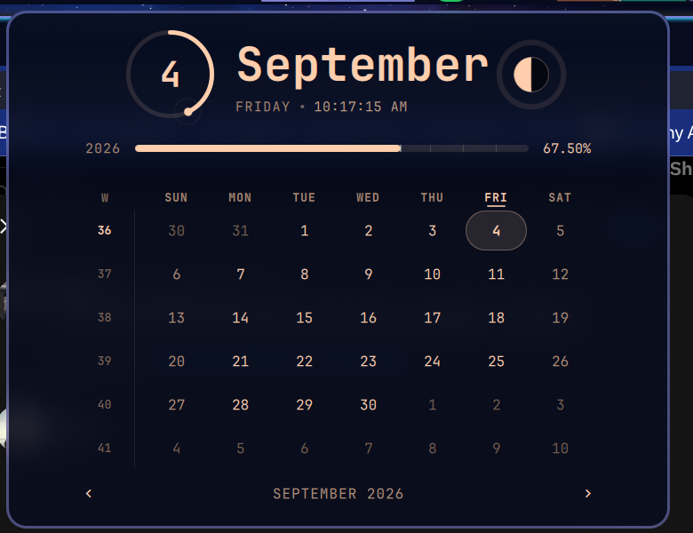

# Chronos

An Omarchy bar clock whose calendar has a pulse.

Chronos is a fork of Omarchy's stock `omarchy.clock` panel. It keeps every bit
of the original's behaviour — the same keys, the same IPC, the same settings,
the same quiet month grid — and adds the motion and read-outs the stock panel
deliberately leaves out.



## What moves

| | |
|---|---|
| **Day ring** | The hero number sits inside a ring that drains as today does, with a pulsing head marking now. Hover it for the percentage and the hours left. |
| **Year rail** | The year-progress bar carries a slow sheen and twelve month ticks. A bar that keeps moving says "still running"; a static one states a number once. |
| **Life rail** | Same treatment for the memento-mori bar, a notch per decade. |
| **Month entrance** | Stepping a month slides the grid in from the side you stepped from, and the cells arrive on a diagonal stagger. |
| **Today** | A soft standing fill plus a breathing ring. Today's weekday heading and ISO week number light up in the accent too, so you find the square without counting across. |
| **Day hover** | The square under the pointer lights up and names itself: full date, day of the year, and how far away it is. |
| **Moon** | Tonight's moon, drawn from the real synodic phase — the terminator is a proper ellipse, not one of eight glyphs. Hover for the phase name, the lit percentage, and days to full. |
| **Drift** | A field of faint motes behind it all, near the noise floor. |
| **Bar label** | A hairline under the bar label that drains with the day. One repaint a minute. |

Everything that moves is gated on the panel actually being open, and all of it
switches off with one setting.

## Install

```bash
git clone https://github.com/nixfred/omarchy-chronos ~/.config/omarchy/plugins/nixfred.chronos
```

Then put it in the bar. Chronos is a drop-in replacement for `omarchy.clock`,
so the usual move is to swap the ids in `~/.config/omarchy/shell.json` and keep
your existing settings:

```jsonc
{
  "bar": {
    "centerAnchor": "nixfred.chronos",
    "layout": {
      "center": [
        { "id": "nixfred.chronos", "format": "ddd d MMM h:mm AP" }
      ]
    }
  }
}
```

New QML files need a full shell restart, not a hot reload:

```bash
omarchy-restart-shell
```

## Settings

Every stock `omarchy.clock` setting still works — `format`, `formatAlt`,
`verticalFormat`, `verticalFormatAlt`, `weekStartDay`, `yearPercentDecimals`,
`birthYear`, `lifeExpectancy`. On top of those:

| Key | Default | What it does |
|---|---|---|
| `sizzle` | `true` | The master switch. `false` leaves the stock read-out plus the drawn moon, at zero animation cost. |
| `moon` | `true` | The moon disc in the hero row. |
| `drift` | `true` | The ambient mote field. Implied off by `sizzle: false`. |
| `liveTime` | `true` | The ticking clock and heartbeat under the date. Also what makes the panel tick per-second while open. |
| `barProgress` | `true` | The day-progress hairline under the bar label. |

## Controls

Unchanged from stock, plus the new IPC calls.

| | |
|---|---|
| Left click | Open / close the calendar |
| Right click | Cycle the bar label format |
| Middle click | Timezone picker |
| Wheel over the grid | Step months |
| `←` `→` / `[` `]` | Step months |
| `↑` `↓` / `{` `}` | Step years |
| `t` / Enter | Back to today |
| `w` | Toggle the week start |
| Click the hero | Back to today |
| Double-click the year rail | Set a birth year — reveals the life rail |
| Double-click the life rail | Hide it again |

```bash
qs -p /usr/share/omarchy/shell ipc call nixfred.chronos toggle
qs -p /usr/share/omarchy/shell ipc call nixfred.chronos nextMonth
qs -p /usr/share/omarchy/shell ipc call nixfred.chronos prevMonth
qs -p /usr/share/omarchy/shell ipc call nixfred.chronos nextYear
qs -p /usr/share/omarchy/shell ipc call nixfred.chronos prevYear
qs -p /usr/share/omarchy/shell ipc call nixfred.chronos today
qs -p /usr/share/omarchy/shell ipc call nixfred.chronos toggleWeekStart
qs -p /usr/share/omarchy/shell ipc call nixfred.chronos cycleFormat
```

## Layout

```
BarWidget.qml      bar label, the day-progress rule, IPC surface
Panel.qml          the calendar popup
Model.js           date, year, day, moon and stagger math — Qt-free, unit-testable
ui/ProgressRing.qml  the day ring (QtQuick.Shapes, animatable sweep)
ui/SizzleRail.qml    a labelled progress rail with the travelling sheen
ui/MoonDisc.qml      the drawn moon; repaints on phase change, not per frame
ui/DayCell.qml       one grid square: entrance, today pulse, hover read-out
ui/DriftField.qml    the ambient mote field
```

The moon uses the standard synodic reckoning — days since the 2000-01-06
18:14 UTC new moon over the mean synodic month — so it needs no network and no
lookup table, and is good to well under a day for any date this panel shows.

## Performance notes

- Nothing animates while the panel is closed; `animating` is `sizzle && opened`.
- The panel clock only runs per-second while it is open *and* something on
  screen resolves that finely.
- The moon repaints when the phase changes — hourly at worst — not per frame.
- The ring is `QtQuick.Shapes` with an animatable sweep angle, so it eases
  without asking for repaints.

## Credit

Forked from [Omarchy](https://github.com/basecamp/omarchy)'s `omarchy.clock`
panel by Basecamp, MIT licensed. The month grid, ISO week numbering, format
ring, week-start handling and memento-mori rail are theirs; the motion,
read-outs and moon are this fork's.

## License

MIT. See [LICENSE](LICENSE).
